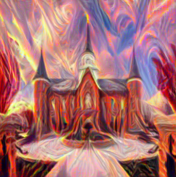

# Deep Learning Projects

This repository contains various deep learning projects that I have implemented.

## Contents

- [Neural Style Transfer](#neural-style-transfer)
- [Recurrent Neural Network GRU](#recurrent-neural-network-gru)

## Neural Style Transfer

### Description
In this project we provide a content image and a stlye image. We then generate loss based on pixel difference and transform the content image to be create in the style of the provided style image.

### Files
`style_transfer.ipynb`: Jupyter notebook with the neural style transfer implementation.
`Images`: Folder containing input examples with the resulting images

### Example Output

### Other Images Produced
 

## Recurrent Neural Network GRU

### Description
This project contains the pytorch implementation of a recurrent neural network with a gated recurrent unit. In this project we create example text output based on the lord of the rings and Donald Trump tweets from a string primer.

### Files
`rnn_gru.ipynb`: Jupyter notebook with the recurrent neural network gru implementation.

### Example Output

